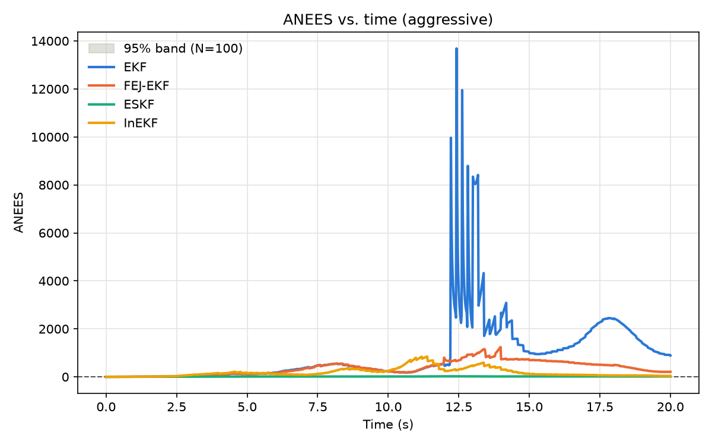
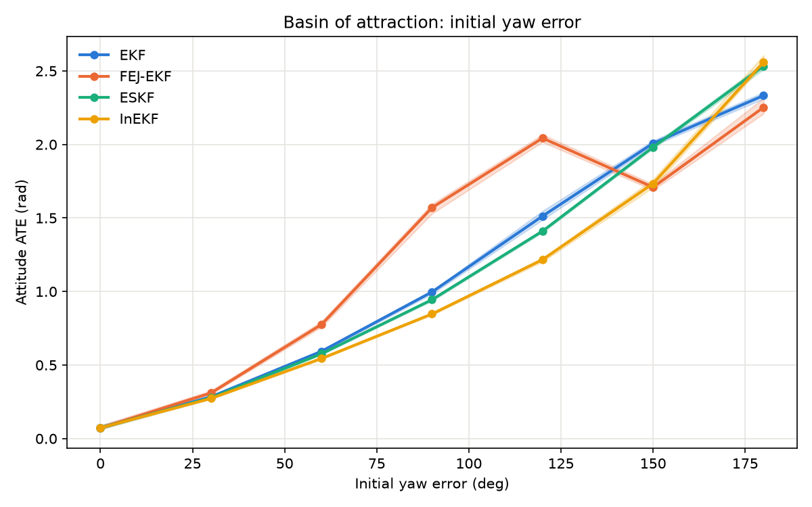

# Kalman Filter Toolkit



**The empirical claim, and its scope.** On a fast, multi-axis IMU trajectory with
intermittent GNSS position fixes (100 Monte Carlo runs, byte-identical sensor
streams across estimators), a standard EKF suffers a severe *transient* consistency
failure — ANEES (ideal value: state dimension, 15) spikes to several thousand for
several seconds around a period of high excitation, meaning its reported covariance
is wildly overconfident right when it matters most. InEKF holds up substantially
better through that same window (median ANEES 170 vs. 213–302 for EKF/FEJ-EKF over
the full run, [`results/aggressive/summary.md`](results/aggressive/summary.md)),
consistent with its structurally exact log-linear error dynamics degrading
gracefully rather than catastrophically once biases are estimated (see
[`docs/inekf.md`](docs/inekf.md)). Two things this figure does *not* claim, stated
plainly rather than smoothed over: this repo's pre-existing ESKF achieves the best
calibration of all four here (median ANEES ~14, closest to ideal) — plausibly
because its noise model is the most maturely tuned of the four adapters, not
necessarily because its error-state formulation is structurally superior, since the
generic EKF/FEJ-EKF and InEKF noise models built for this benchmark are explicitly
simpler constructions (see `benchmark/estimators.py`); and FEJ-EKF's benefit over
plain EKF shows up clearly at the worst *instant* (its peak spike is roughly 6× 
smaller — see the figure) but not uniformly in the whole-run-averaged median
statistic, where it is occasionally slightly worse. Both nuances are real Monte
Carlo output, not cherry-picked. Reproduce this figure and every other one with
`python -m benchmark.generate_all`.

Kalman Filter Toolkit is a compact, test-driven repository for state estimation,
noise modeling, and filter health checks. It is designed around a simple rule: the
filter is not done until the noise model and diagnostics exist alongside it — and,
now, until its consistency has been checked against the others, not just against
itself.

## What makes it different

- Noise characterization is first-class, including Allan variance, process-noise
  discretization, and measurement-noise estimation.
- Diagnostics are built in, with NIS/NEES, innovation consistency checks, and
  covariance health repair utilities.
- A reproducible Monte Carlo benchmark harness (`benchmark/`) runs every kernel on
  byte-identical simulated sensor streams and reports ANEES/ANIS with χ² bounds,
  ATE/RTE, divergence rate, and runtime — median and IQR across ≥100 runs, never a
  single representative run.
- Case studies are scoped to real estimation problems so each filter earns its
  place.

## Kernel taxonomy

The eight kernels aren't a flat list — they differ along independent axes. InEKF
and FEJ-EKF exist specifically to fill the **state-space geometry** and
**consistency handling** cells that the original six left empty.

| Kernel | Nonlinearity handling | State-space geometry | Consistency handling | Uncertainty adaptation | Numerical form |
|---|---|---|---|---|---|
| [`KF`](filters/kf.py) | linear (exact) | Euclidean | exact (linear-Gaussian) | fixed | standard covariance |
| [`EKF`](filters/ekf.py) | Jacobian linearization | Euclidean | naive (linearizes at current estimate) | fixed | standard covariance |
| [`FEJ-EKF`](filters/ekf.py) (`use_fej=True`) | Jacobian linearization | Euclidean | first-estimates (observability-consistent) | fixed | standard covariance |
| [`UKF`](filters/ukf.py) | sigma-point (derivative-free) | Euclidean | naive | fixed | standard covariance |
| [`ESKF`](filters/eskf.py) | local error-state linearization | quaternion + minimal error-state | naive | fixed | standard covariance |
| [`Square-Root KF`](filters/sq_root.py) | linear (exact) | Euclidean | exact | fixed | Cholesky/QR factorized |
| [`Sage-Husa Adaptive KF`](filters/adaptive.py) | linear (exact) | Euclidean | naive | online adaptive (Q, R) | standard covariance |
| [`InEKF`](filters/inekf.py) | exact log-linear (group-affine) | matrix Lie group SE₂(3) | structurally exact (bias-free); degrades gracefully with bias | fixed | standard covariance |

See [`docs/inekf.md`](docs/inekf.md) and [`docs/fej_ekf.md`](docs/fej_ekf.md) for
the actual derivations behind the geometry and consistency columns — group-affine
condition, error dynamics, why the measurement Jacobian is constant under the
matched error convention, and the observability argument, with equations.

## Quick Start

```bash
pip install -e ".[dev]"
pytest tests/ -v
```

### Minimal 2D Tracker Example

```python
import numpy as np
from filters.kf import KalmanFilter
from noise.process_noise import pcwn_1d

dt = 0.1
F_1d = np.array([[1.0, dt], [0.0, 1.0]])
Q_1d = pcwn_1d(dt, sigma_a=0.2)
F = np.block([[F_1d, np.zeros((2, 2))], [np.zeros((2, 2)), F_1d]])
Q = np.block([[Q_1d, np.zeros((2, 2))], [np.zeros((2, 2)), Q_1d]])
H = np.array([[1.0, 0.0, 0.0, 0.0], [0.0, 0.0, 1.0, 0.0]])
R = np.diag([2.0, 2.0])

kf = KalmanFilter(F=F, H=H, Q=Q, R=R, x0=np.zeros(4), P0=np.eye(4) * 10.0)

measurement = np.array([10.0, 5.0])
kf.predict()
kf.update(measurement)
print(kf.x)
```

## Monte Carlo Consistency Benchmark

`benchmark/` runs EKF, FEJ-EKF, ESKF, and InEKF on identical IMU + GNSS sensor
streams (same trajectory, same noise realization, same initial-error draw per
run — asserted directly in `tests/test_benchmark_harness.py`) and reports:

- **ANEES / ANIS vs. time**, with χ² confidence bounds at the correct degrees of
  freedom for N runs × state dimension, plotted as a shaded band.
- **ATE / RTE**, reported separately for attitude, velocity, position — median and
  IQR across runs, never mean-only and never a single run.
- **Divergence rate**, against a threshold declared in the config up front.
- **Runtime per update**, mean and p95 tail.

Regenerate every figure and table from scratch:

```bash
python -m benchmark.generate_all
```

Results land in `results/<config_name>/` (figures + `summary.csv`/`summary.md`) and
`results/ablations/`. Raw per-run data is cached under `results/cache/`, keyed on a
hash of the full config, so re-plotting doesn't require re-simulating — delete that
directory to force a clean re-run (necessary after changing any filter's code, since
the cache key doesn't know about code changes, only config changes).

### Ablations

Each of the following is one YAML config in `benchmark/configs/` and one figure in
`results/ablations/`:

| Ablation | Swept parameter | Config |
|---|---|---|
| Basin of attraction | initial yaw error, 0° → 180° | `ablation_yaw_sweep.yaml` |
| Initial error magnitude | initial position/velocity error scale | `ablation_init_error.yaml` |
| IMU noise scaling | gyro/accel noise scale | `ablation_imu_noise.yaml` |
| GNSS outage | outage window length, 0s → 10s | `ablation_gnss_outage.yaml` |



Read this one carefully rather than assuming the obvious story: all four kernels
degrade similarly up to about 90° of initial yaw error on this 10s aggressive-
trajectory, GNSS-only-position-update config, and converge toward similarly large
attitude error by 180° (a position-only measurement doesn't fully resolve attitude
information fast enough on this short a window to rescue any of them from a
near-antipodal start). FEJ-EKF is visibly *worse* than the others in the 90–120°
range — its frozen linearization point, if that first estimate happens to be badly
wrong, stays wrong for longer than a standard EKF's continuously-updated one; this
is a real, known trade-off of FEJ (consistency vs. adaptivity to a bad start), not
a bug. The init-error and IMU-noise ablations (`results/ablations/`), by contrast,
show near-identical curves across all four kernels — expected, since pure
position/velocity ATE under gentle excitation doesn't exercise the attitude-geometry
differences these kernels exist to address; the interesting differentiator in this
repo's results is filter *consistency* (ANEES), not raw accuracy.

## Case Studies

| # | Problem | Filters Used | Key Concepts |
|---|---|---|---|
| 01 | 2D tracking with position measurements | KF, EKF | Covariance ellipses, NIS/NEES, Monte Carlo consistency |
| 02 | GNSS-denied IMU dead reckoning | ESKF | Allan variance, quaternion attitude, bias drift |
| 03 | Adaptive tuning under mismatch | Adaptive KF | Sage-Husa, Mehra R estimation, failure analysis |
| 04 | Tightly coupled multisensor fusion | ESKF, KF | Async updates, chi-squared gating, integrity checks |
| 05 | Filter vs smoother vs graph | EKF, RTS smoother, factor graph | ATE/RPE, batch vs recursive estimation |

## Design Principles

1. The filter does not exist until the case study needs it.
2. Noise modeling is not an afterthought.
3. Diagnostics are mandatory — and consistency is checked across kernels on
   identical data, not just within one kernel on its own run.
4. Real data should be used wherever possible.
5. A structural claim (log-linearity, observability, a Jacobian's constancy) is
   settled with a numerical test, not asserted from a paper.

## References

Foundational references include Bar-Shalom, Solà, Barfoot, Särkkä, Mehra,
Sage-Husa, Wan-Merwe, Van Loan, Trawny-Roumeliotis, IEEE 647-2006, Barrau &
Bonnabel, Hartley et al., Huang-Mourikis-Roumeliotis, and Hesch et al. — see
[`docs/references.bib`](docs/references.bib).
